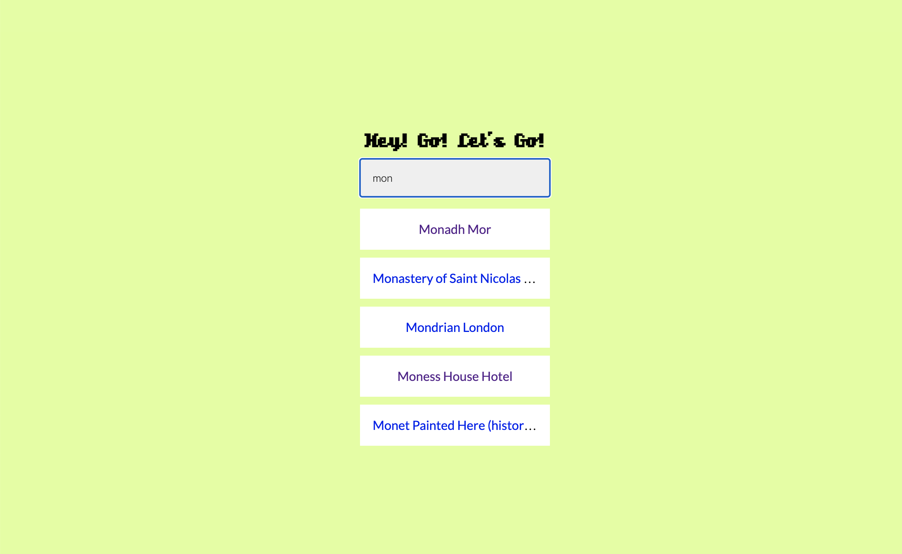

## Welcome to *Hey! Go! Let's Go!*

This is a little app that will perform an API call to show you a list of places to visit.
You will be able to click on the different links that are appearing under the search bar, which will lead you to the location with a google map iframe.
From the location page, you will find a button taking you back to the homepage where you can perform a new search.



### Can I use that amazing app locally?

Of course you can!

To start you will need to clone this repo with:
```git clone git@github.com:gekographe/heygothere.git```

Then, once the repo is available on your computer, move inside the repo with `cd heygothere/`.

When you're in, you'll have to install the dependencies with `npm i` or `npm install`. It will install everything you need to run this project locally.

Finally to start the app you will only need to run `npm start`. It should open a new page in your browser to [localhost:3000](http://localhost:3000/).

And *voilà!* 